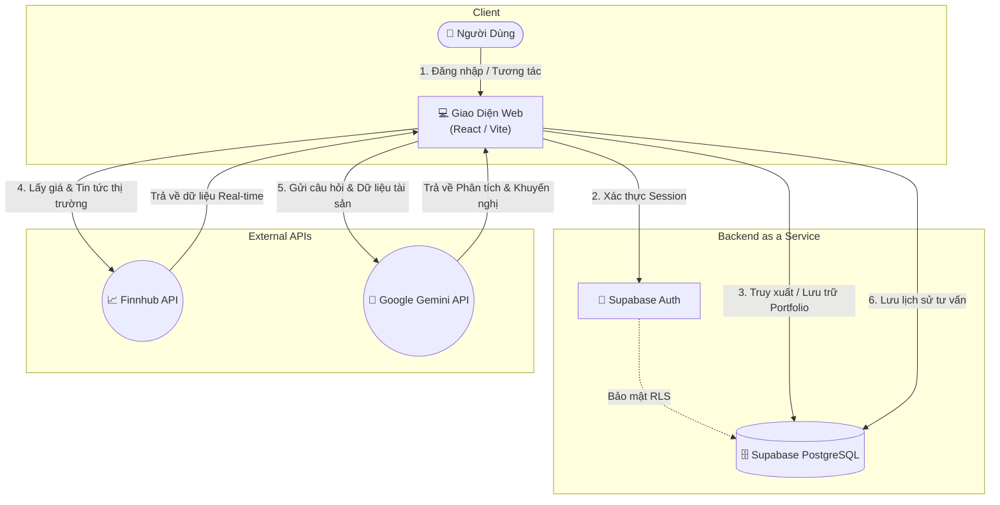

# 📈 FinAdvisor - Cố Vấn Tài Chính AI (SaaS)

FinAdvisor là một ứng dụng Web (SaaS) hỗ trợ quản lý tài chính cá nhân và đầu tư, được tích hợp Trợ lý Trí tuệ Nhân tạo (AI) cực kỳ mạnh mẽ. Ứng dụng giúp người dùng theo dõi danh mục đầu tư theo thời gian thực, cập nhật tin tức thị trường và nhận được những lời khuyên chuyên sâu từ AI dựa trên chính dữ liệu tài sản của họ.

---

## ✨ Chức Năng Nổi Bật (Core Features)

- 🔐 **Xác Thực & Định Danh (Authentication)**: Đăng nhập và Đăng xuất an toàn, quản lý phiên làm việc (session) hoàn toàn bảo mật thông qua Supabase Auth.
- 📊 **Dashboard Tổng Quan**: Cung cấp cái nhìn toàn cảnh về tổng tài sản, tính toán tổng lãi/lỗ và trực quan hóa phân bổ tài sản thông qua biểu đồ (Donut chart).
- 💼 **Quản Lý Danh Mục Đầu Tư (Portfolio)**: Quản lý chi tiết các mã cổ phiếu đang nắm giữ. Dễ dàng thêm mới, chỉnh sửa số lượng, giá mua và theo dõi định giá thực tế so với giá thị trường.
- 📈 **Bảng Giá Trực Tuyến (Live Watchlist)**: Theo dõi biến động giá cổ phiếu toàn cầu (MSFT, AAPL, V, TSLA...) theo thời gian thực với các chỉ số cao/thấp, tăng/giảm.
- 📰 **Tra Cứu Tin Tức Thông Minh (Market News)**: Khám phá tin tức kinh tế vĩ mô hoặc tra cứu tin tức chuyên sâu của từng doanh nghiệp/mã cổ phiếu cụ thể.
- 🤖 **Trợ Lý AI Cá Nhân Hóa (Gemini AI)**: AI có khả năng đọc hiểu danh mục đầu tư hiện tại của bạn để phân tích tỷ trọng, đưa ra chiến lược quản trị rủi ro và giải đáp các thắc mắc về tài chính (ví dụ: cảnh báo rủi ro khi tỷ trọng một cổ phiếu quá cao).
- ⚙️ **Quản Lý & Bảo Mật (Settings)**: Hệ thống quản lý tài khoản an toàn. Cho phép người dùng tự cấu hình API Keys cá nhân (Gemini, Finnhub), thay đổi mật khẩu và tùy chọn xóa toàn bộ dữ liệu an toàn.

---

## 🏗️ Kiến Trúc Hệ Thống (System Architecture)

Dự án được xây dựng trên nền tảng Single Page Application (SPA) hiện đại, kết hợp chặt chẽ giữa các dịch vụ Backend as a Service (BaaS) và các API của bên thứ ba.

### 1. Frontend (Giao Diện Người Dùng)
- **Core**: **React 18** và **Vite** (build tool thế hệ mới).
- **Routing**: React Router DOM.
- **Biểu đồ (Data Visualization)**: Recharts (hiển thị biểu đồ phân bổ tài sản).
- **Styling**: Tailwind CSS (Giao diện tối ưu UI/UX, responsive và hỗ trợ Light/Dark mode).

### 2. Backend & Cơ Sở Dữ Liệu
- **BaaS**: **Supabase**.
- **Database**: PostgreSQL (quản lý User Profile, Portfolios, Chat History).
- **Authentication**: Supabase Auth (Hỗ trợ Đăng nhập, bảo mật người dùng).
- **Bảo mật**: Row Level Security (RLS) được thiết lập chặt chẽ bằng PostgreSQL để đảm bảo dữ liệu cá nhân hoàn toàn bảo mật. Các Functions/RPC được dùng cho các tác vụ phức tạp (như xóa tài khoản toàn diện).

### 3. Tích Hợp API Bên Thứ Ba (3rd Party Integrations)
- **Market Data Engine**: **Finnhub API** - Cung cấp dữ liệu giá cổ phiếu trực tuyến và tin tức tài chính.
- **AI Engine**: **Google Gemini API** (`@google/generative-ai`) - "Bộ não" của hệ thống, xử lý ngôn ngữ tự nhiên và phân tích dữ liệu danh mục đầu tư.

---

## 🔄 Sơ Đồ Hoạt Động (Workflow Diagram)

Sơ đồ dưới đây mô tả cách các thành phần trong hệ thống tương tác với nhau để cung cấp trải nghiệm quản lý tài chính và tư vấn AI mượt mà:



---

## 🚀 Hướng Dẫn Cài Đặt (Installation)

1. **Clone repository và cài đặt các dependencies:**
   ```bash
   git clone <your-repo-url>
   cd financial-advisor-saas
   npm install
   ```

2. **Cấu hình biến môi trường (.env.local):**
   Tạo file `.env.local` ở thư mục gốc và cung cấp các khóa API cần thiết:
   ```env
   VITE_SUPABASE_URL=your_supabase_url
   VITE_SUPABASE_ANON_KEY=your_supabase_anon_key
   # Finnhub và Gemini API keys có thể được người dùng cấu hình trực tiếp từ giao diện (trang Settings).
   ```

3. **Thiết lập Cơ Sở Dữ Liệu (Supabase):**
   Chạy các script SQL có sẵn trong repo vào mục SQL Editor của Supabase để khởi tạo các bảng và các hàm bảo mật:
   - `supabase_schema.sql`
   - `add_check_email_rpc.sql`
   - `add_delete_account_rpc.sql`
   - `add_chat_history.sql`

4. **Khởi chạy ứng dụng:**
   ```bash
   npm run dev
   ```
   Ứng dụng sẽ chạy tại `http://localhost:5173`.

---

## 📁 Cấu Trúc Thư Mục Chính (Folder Structure)

- `/src`: Chứa toàn bộ mã nguồn React (Components, Pages, Context, Utils).
- `/public`: Các tài nguyên tĩnh.
- `/*.sql`: Các tệp kịch bản khởi tạo cơ sở dữ liệu và bảo mật trên Supabase.
- `/*.md`: Các tài liệu thiết kế hệ thống, ghi chú quá trình phát triển dự án.

---

*Được phát triển với mục tiêu mang lại trải nghiệm quản lý tài chính chuyên nghiệp, an toàn và thông minh cho người dùng.*
